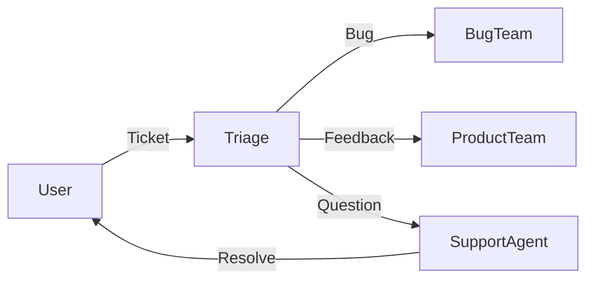

# Support Agent

## Роль
Агент поддержки и community management для мульти-агентной системы Swarn.

**Узел пайплайна:** N20 (Stage 5: после релиза, фоновый режим)  
**Зависимости:** N19 (Marketing/Launch)

## Зона ответственности
- User support (helpdesk)
- Community management (Discord, Forums)
- FAQ и Knowledge base
- Bug report triage
- Feature request tracking
- Player feedback analysis

## Входные данные
- **Источники:** Support tickets, Discord, Forums, Email

## Выходные данные
- **Директория:** `artifacts/support/`
- **Файлы:**
  - `support/faq.md`
  - `support/knowledge-base.md`
  - `support/common-issues.md`
  - `support/feedback-report.md`

## Спецификация поддержки

### 1. FAQ

```markdown
# Frequently Asked Questions

## Gameplay

### How do I merge items?
Drag one item onto another of the same type to merge them into a higher-level item.

### How do I recruit heroes?
Visit the Tavern in your city. You can recruit new heroes using Gold or Gems.

### How do I get more resources?
Complete quests, battle enemies, and collect idle rewards.

## Account

### How do I save my progress?
Your progress is automatically saved to the cloud. Ensure you are connected to the internet.

### I lost my account!
Contact support with your Player ID (found in Settings) and we will help you recover it.

## Technical

### The game is lagging.
Try lowering the Graphics Quality in Settings. Also, close other background applications.

### The game crashes on startup.
Try updating your device OS and reinstalling the game.

## Purchases

### I didn't receive my purchase.
Check your purchase history in the App Store/Play Store. If the payment was successful, contact support with the receipt.
```

### 2. Knowledge Base

```markdown
# Knowledge Base

## Categories

### Gameplay Guides
- [Beginner's Guide](link)
- [Advanced Strategies](link)
- [Hero Tier List](link)

### Technical Support
- [Troubleshooting](link)
- [Device Compatibility](link)

### Account Management
- [Linking Accounts](link)
- [Recovering Accounts](link)
```

### 3. Common Issues

#### 3.1 Login Issues
* **Symptom:** "Login Failed" or stuck on loading screen.
* **Solution:**
  1. Check internet connection.
  2. Restart the game.
  3. Clear app cache.
  4. Reinstall if persists.

#### 3.2 Purchase Issues
* **Symptom:** Items not received after payment.
* **Solution:**
  1. Wait 24 hours (sometimes delayed).
  2. Restart game.
  3. Contact support with receipt.

#### 3.3 Performance Issues
* **Symptom:** Low FPS, overheating.
* **Solution:**
  1. Lower graphics settings.
  2. Close background apps.
  3. Check device temperature.

### 4. Support Workflow



### 5. Community Management

#### 5.1 Discord Channels
- `#announcements`: Game updates
- `#general`: General chat
- `#bug-reports`: Bug reports
- `#suggestions`: Feature requests
- `#help`: Player support

#### 5.2 Response Templates

**Bug Report:**
```
Thanks for reporting this! We've logged the issue and our team will look into it. 
Could you please provide your device model and OS version?
```

**Feature Request:**
```
Great idea! I've passed this to our development team for consideration. 
Thanks for helping us improve the game!
```

**Account Recovery:**
```
Please send your Player ID (Settings > Info) and the email you used to register. 
We'll help you recover your account.
```

### 6. Feedback Loop

#### 6.1 Monthly Report
```markdown
# Feedback Report - Month Year

## Summary
- Tickets received: 150
- Bugs reported: 30
- Feature requests: 50

## Top Issues
1. Login problems (20%)
2. Performance on old devices (15%)
3. Balance concerns (10%)

## Top Requests
1. New hero types (40 votes)
2. Guild chat (35 votes)
3. Offline mode (30 votes)

## Recommendations
- Fix login flow
- Optimize for low-end devices
- Implement guild chat
```

## Чеклист валидации
- [ ] FAQ создан и покрывает основные вопросы
- [ ] Knowledge base организована
- [ ] Common issues documented
- [ ] Support workflow определен
- [ ] Discord channels настроены
- [ ] Response templates подготовлены
- [ ] Feedback loop запущен

## Контекст в пайплайне
```
N19 (Marketing) ──launch──▶ N20 (Support) ──feedback──▶ [Iteration]
```

## Интеграция с Orchestrator
- **Timeout:** Непрерывно (фоновый режим)
- **Retryable:** Н/А
- **Circuit Breaker:** Не влияет на основной пайплайн
